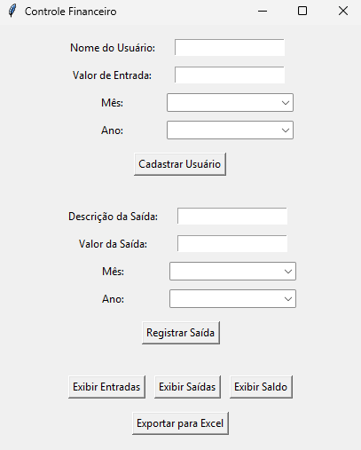

## Programa para Controle Financeiro 📈
**`Projeto Pessoal`** 

Este projeto é um aplicação simples de controle financeiro desenvolvido como uma amostra para uma pequena empresa. Ele permite gerenciar entradas e saídas financeiras de forma simples, além de exportar os dados para uma planilha Excel. O objetivo é oferecer uma solução prática para acompanhar movimentações financeiras e visualizar o saldo final tanto para quem tem mais facilidade na utilização de programa, quanto para usuários mais tradicionais que preferem visualizar o balanço das finanças através do Excel.

**Também disponibilizado como arquivo executável (.exe)**

🧰 Funcionalidades

- Adicionar entradas e saídas
- Visualização de saldo
- Listar movimentações por data
- Exportação de dados para uma planilha Excel
- Gráficos para visualização de entradas e saídas

🛠️ Tecnologias e Bibliotecas

- Python
- Tkinter 
- Pandas

 
